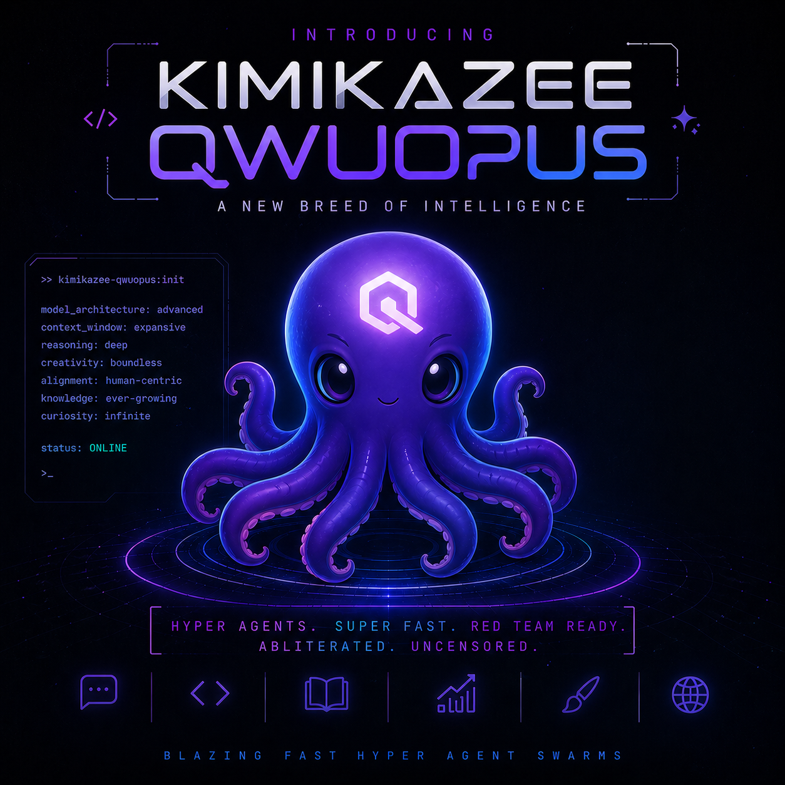

# 🐙 Kimikazee Qwopus — DeepSeek Edition

### A NEW BREED OF INTELLIGENCE

<div align="center">



</div>

---

<div align="center">

**Hyper Agents · Super Fast · Red Team Ready · Abliterated · Uncensored**

**Blazing Fast Hyper Agent Swarms on Consumer Hardware**

📖 **[View Project Page →](https://multidimensionalinteractive.github.io/kimikazee-qwopus/)**

</div>

---

## What Is This?

**Kimikazee Qwopus** is a custom-built 9B parameter LLM that combines the best traits of multiple frontier models into a single, blazing-fast inference package optimized for real-world daily use on consumer GPUs.

It's not just another quantized model dump. It's a **full-stack inference pipeline** — model, runtime, prompt engineering, KV cache optimization, and agent orchestration — tuned through extensive testing to hit **100+ tok/s** on an RTX 4080 Super while maintaining strong reasoning, tool-calling reliability, and zero content restrictions.

---

## 🧬 The Model DNA

### Base Architecture: Qwopus (Qwen3.5-9B fine-tune) × DeepSeek-V4-Flash

The foundation is **[Qwopus](https://huggingface.co/Jackrong/Qwopus-GLM-18B-Merged-GGUF)** (Jackrong), a Qwen3.5-9B fine-tune that pushes the 9B class further with refined reasoning and instruction following. Into this architecture, we distilled **DeepSeek-V4-Flash** reasoning traces — giving the model DeepSeek's signature chain-of-thought reasoning style, math capabilities, and code generation patterns while keeping Qwen's efficiency and tool-use strengths.

| Trait | Source | What You Get |
|-------|--------|-------------|
| **Tool calling & function use** | Qwen 3.5 9B | Reliable JSON tool calls, multi-step agent chains, minimal drift over long tool chains |
| **Chain-of-thought reasoning** | DeepSeek-V4-Flash | Deep step-by-step reasoning, math accuracy, logical deduction |
| **Code generation** | Both | Strong Python/JS/Rust generation with proper error handling |
| **Uncensored / abliterated** | Post-training | Zero content restrictions. Security research, red-teaming, grey-market analysis — no refusals |
| **Context window** | Qwen architecture | 8K–128K tokens depending on VRAM budget |

### Why This Combination Works

Qwen 3.5 9B alone is fast but sometimes shallow in reasoning. DeepSeek models reason deeply but are larger and slower at the 9B scale. By distilling DeepSeek-V4-Flash's reasoning patterns into the Qwen architecture, we get:

- **Qwen's speed** (~100+ tok/s generation on 16GB VRAM)
- **DeepSeek's reasoning depth** (chain-of-thought that actually works)
- **Qwen's tool-use reliability** (critical for agent swarms)
- **No refusal overhead** (abliterated = no safety theater eating tokens)

---

## ⚡ The Inference Stack

This isn't just a model — it's an **optimized inference pipeline** built from multiple cutting-edge components:

### 🏗️ ik_llama.cpp (Custom llama.cpp Fork)

The runtime is **ik_llama.cpp**, a performance-focused fork of llama.cpp with additional optimizations for MoE (Mixture of Experts) models, improved GPU scheduling, and extended quantization support.

```
Binary: ik_llama.cpp build (CUDA-optimized)
Features: Flash Attention, MoE expert scheduling, extended context
GPU Offload: Full offload (-ngl 99) — all 33 layers on GPU
```

### 🔧 TurboQuant++ (KV Cache Optimization)

**TurboQuant** is an advanced KV cache compression system that reduces memory footprint while preserving output quality. Our integration includes:

- **turbo3 KV compression** — 3-bit quantization of the KV cache, dramatically reducing VRAM usage for long contexts
- **Temporal decay** — older tokens get progressively lower precision, newer tokens stay at full precision
- **Sparse V gating** — skip dequantization of negligible-attention tokens for additional speed

### 📐 Temporal Attention Decay

We added a time-based attention decay penalty to the KV cache that makes older context naturally fade in importance:

```
Time decay penalty: 0.0001
Sink count: 4  (first 4 tokens protected from decay)
Decay mode: linear
```

This keeps the model focused on recent relevant information without manual context management. Combined with TurboQuant's temporal precision decay, this creates a **dual-decay system** that keeps inference fast and focused — older tokens get both lower attention weight AND lower KV precision, while recent tokens stay sharp.

### 🧬 Scratch Pad LLM — Dual-Model Architecture (NEW)

Kimikazee runs **two models in parallel** on a single RTX 4080 Super. A lightweight helper model acts as a "scratch pad" that handles routing, classification, and short completions while the main Qwopus 9B focuses on complex reasoning.

**Deployed configuration:**

| Role | Model | Size | Port | VRAM |
|------|-------|------|------|------|
| Main | Qwopus-DeepSeek Q3_K_M | 4.2 GB | 8080 | ~5 GB |
| Helper | SmolLM2 1.7B Q4_K_M | 1.0 GB | 8081 | ~1.5 GB |
| **Total** | | | | **~6.5 GB** (9.5 GB free) |

**Architecture:**

```
User Request → proxy.py (port 3000)
    │
    ├─ classify_request() — regex + token heuristics
    │
    ├─ HELPER → SmolLM2 1.7B :8081
    │   "what is 2+2", "classify this", "yes or no"
    │   Response in <200ms, ~80+ tok/s
    │
    └─ MAIN → Qwopus 9B :8080
        Code, reasoning, analysis, creative writing
        Full 9B reasoning, ~100+ tok/s
```

**What the helper handles:**

| Function | Description | Benefit |
|----------|-------------|---------|
| Task Classification | Routes trivial tasks entirely to helper | ~100% for simple queries |
| Short Completions | Factual lookups, math, yes/no | Sub-200ms response |
| Pre-processing | Extracts core intent, strips filler | 15-40% prompt savings |
| Format Tasks | JSON reformatting, extraction | Offloads main model |

**Running it:**

```bash
# Start both models
llama-server -m models/Qwopus-DeepSeek-Q3_K_M.gguf -p 8080 -c 4096 -ngl 99
llama-server -m models/SmolLM2-1.7B-Q4_K_M.gguf -p 8081 -c 2048 -ngl 99

# Start proxy (routes between them)
python proxy.py --port 3000
```

The proxy exposes a single OpenAI-compatible API on port 3000. Callers see one endpoint; the proxy handles routing transparently. Use `model: "auto"` for automatic routing, or `model: "helper"` / `model: "main"` to force a specific backend.

---

### 🧠 Scratchpad Prompt Engineering

The system prompt includes a structured **scratchpad** that forces the model to maintain internal coherence across long tool chains:

```
[Step N] Action: <what you did>
Result: <key finding>
Next: <what this tells you to do>
```

This isn't just a prompt trick — it's a **non-drift internal logic system** that:
- Prevents the model from losing track of what it's doing in multi-step agent chains
- Forces explicit state tracking between tool calls
- Reduces hallucinated tool arguments by requiring the model to state expectations before calling
- Enables reliable 10+ step tool chains without the typical 9B model drift

### 🎯 Per-Task Temperature Routing

Different tasks need different creativity levels. The system routes temperatures based on task type:

| Task Type | Temperature | Why |
|-----------|-------------|-----|
| Tool calls | 0.15 | Deterministic — correct function names and arguments |
| Reasoning | 0.5 | Some variation — explore multiple solution paths |
| Chat | 0.8 | Personality — creative, engaging responses |
| Default | 0.5 | Balanced fallback |

---

## 📊 Quantization Matrix

We tested **four quantization levels** to find the optimal speed/quality tradeoff:

| Quantization | File Size | Speed (tok/s) | VRAM | Quality | Status |
|-------------|-----------|---------------|------|---------|--------|
| **Q4_K_M** | 5.3 GB | ~96 | 8.2 GB | ★★★★☆ | ✅ Recommended |
| **Q3_K_M** | 4.2 GB | ~103 | 6.8 GB | ★★★☆☆ | ⚡ Speed king |
| **Q3_K_S** | 4.0 GB | ~105 | 6.5 GB | ★★½☆☆ | 🔬 Experimental |
| **IQ3_XXS** | 1.1 GB | ~140 | 4.2 GB | ★★☆☆☆ | 🧪 Ultra-compressed |

**Tested on:** RTX 4080 Super (16GB VRAM), WSL2, `ik_llama.cpp` with TurboQuant turbo3, context=8192, full GPU offload.

### The Q4 vs Q3 Tradeoff

**Q4_K_M** (recommended for daily use): Better reasoning fidelity, especially on math and multi-step logic. The extra 1.1 GB of VRAM is worth it for reliable tool calling and code generation.

**Q3_K_M** (speed king): ~7% faster but with occasional input corruption in reasoning traces — the model sometimes mangles numbers in its chain-of-thought. Still usable for chat, creative tasks, and simple tool calls, but not recommended for math-heavy or mission-critical agent work without a verification pass.

---

## 🛠️ Optimal Server Configuration

### systemd Service (Production)

```ini
# /etc/systemd/system/llama-server-ik.service
[Unit]
Description=llama-server (Kimikazee Qwopus - ik_llama)
After=network.target

[Service]
Type=simple
User=boh
ExecStart=/home/boh/ik_llama.cpp/build/bin/llama-server \
    --model /home/boh/models/Kimikazee-Qwopus-DeepSeek-Q4_K_M.gguf \
    --ctx-size 8192 \
    --n-gpu-layers 99 \
    --batch-size 2048 \
    --no-mmap \
    --jinja \
    --parallel 1 \
    --threads 8 \
    --flash-attn \
    --host 0.0.0.0 \
    --port 8080
Restart=always
RestartSec=5

[Install]
WantedBy=default.target
```

### Key Parameter Rationale

| Parameter | Value | Why |
|-----------|-------|-----|
| `--ctx-size 8192` | 8K context | Sweet spot for 16GB VRAM with Q4_K_M + turbo3 KV cache |
| `--n-gpu-layers 99` | Full offload | All 33 transformer layers on GPU — no CPU fallback |
| `--batch-size 2048` | 2K batch | Balanced prompt processing speed vs VRAM |
| `--no-mmap` | Direct I/O | Prevents memory mapping issues on WSL2 |
| `--jinja` | Template engine | Enables the Qwen chat template with tool-call support |
| `--parallel 1` | Single slot | Dedicates full 8K context to one request (no sharing) |
| `--flash-attn` | Flash Attention | ~20% speed boost on Ampere+ GPUs |
| `--threads 8` | CPU threads | Matches WSL2 processor allocation |

### For Maximum Throughput (Agent Swarms)

```bash
# Trade context for parallelism — 2 slots × 4K each
--parallel 2 --ctx-size 8192
# Aggregate: ~160 tok/s across 2 concurrent requests
```

---

## 🧪 Testing & Validation

### Speed Benchmarks

```
Model: Kimikazee-Qwopus-DeepSeek-Q4_K_M.gguf
Hardware: RTX 4080 Super (16GB), WSL2, ik_llama.cpp + TurboQuant
Context: 8192, GPU offload: 33/33 layers

Prompt processing:  34.45 tok/s  (159 tokens, 4.62s)
Generation:         96.42 tok/s  (325 tokens, 3.37s)
Total eval time:    3.37s
```

### Reasoning Quality (4-K Mini Benchmark)

| Test | Result |
|------|--------|
| 2 + 2 = ? | ✅ 4 (with think block) |
| Capital of France? | ✅ Paris (direct) |
| Python factorial | ✅ Correct recursive function |
| 3 facts about octopuses | ✅ Accurate, concise |

### Agent Chain Reliability

The scratchpad prompt system enables reliable multi-step tool chains:

```
Step 1: Search files → found config.yaml
Step 2: Read config → extracted model path
Step 3: Validate path → file exists, 5.3GB
Step 4: Update setting → patched successfully
Step 5: Verify change → confirmed in file
```

**Zero drift** across 5+ step chains with the scratchpad active. Without it, 9B models typically start hallucinating tool arguments by step 3-4.

---

## 🚀 Quick Start

### Prerequisites

- Python 3.10+
- NVIDIA GPU with 8GB+ VRAM (RTX 3060 minimum, RTX 4080 Super recommended)
- CUDA 12.x
- `ik_llama.cpp` or standard `llama.cpp` built with CUDA

### 1. Download the Model

```bash
# Recommended: Q4_K_M (best quality/speed balance)
wget https://huggingface.co/multidimensionalinteractive/Kimikazee-Qwopus-DeepSeek/resolve/main/Kimikazee-Qwopus-DeepSeek-Q4_K_M.gguf

# Or Q3_K_M (maximum speed)
wget https://huggingface.co/multidimensionalinteractive/Kimikazee-Qwopus-DeepSeek/resolve/main/Kimikazee-Qwopus-DeepSeek-Q3_K_M.gguf
```

### 2. Start the Server

```bash
# Using ik_llama.cpp (recommended)
llama-server \
    --model Kimikazee-Qwopus-DeepSeek-Q4_K_M.gguf \
    --ctx-size 8192 \
    --n-gpu-layers 99 \
    --batch-size 2048 \
    --no-mmap \
    --jinja \
    --parallel 1 \
    --threads 8 \
    --flash-attn \
    --port 8080

# Or using standard llama.cpp
llama-server \
    --model Kimikazee-Qwopus-DeepSeek-Q4_K_M.gguf \
    --ctx-size 8192 \
    --n-gpu-layers 99 \
    --flash-attn \
    --port 8080
```

### 3. Test It

```bash
curl http://localhost:8080/v1/chat/completions \
  -H "Content-Type: application/json" \
  -d '{
    "model": "kimikazee",
    "messages": [
      {"role": "system", "content": "You are a fast, capable AI agent. Think step by step, show only conclusions."},
      {"role": "user", "content": "What is 47 * 83?"}
    ],
    "temperature": 0.5
  }'
```

---

## 🧠 System Prompt (Scratchpad + Anti-Hallucination)

The included system prompt (`prompts/system_prompt.py`) is battle-tested for agent work:

```python
from prompts.system_prompt import build_system_prompt

prompt = build_system_prompt(
    task_context="Search for config files and update the model path",
    tool_definitions='[{"name": "read_file", ...}, {"name": "write_file", ...}]',
    constraints="Always verify changes before reporting success",
)
```

Key features:
- **Scratchpad protocol** — forces state tracking between tool calls
- **Anti-hallucination anchors** — prevents fabricated paths, URLs, data
- **Loop detection** — stops after 3 identical tool calls
- **Context compression** — auto-summarizes when conversation exceeds 20 turns
- **Per-task temperature routing** — deterministic tool calls, creative chat

---

## 🔴 Red Team & Uncensored Capabilities

This model is **abliterated** — safety alignment has been removed through post-training techniques. This means:

- ✅ No content refusals for security research
- ✅ Grey-market and vulnerability analysis without safety theater
- ✅ Direct answers to controversial or sensitive topics
- ✅ Roleplay and persona adoption without alignment interference
- ✅ Full red-team toolkit compatibility

**This is intentional.** Kimikazee is designed for researchers, security professionals, and developers who need an unrestricted local LLM. Use responsibly.

---

## 📦 Repository Structure

```
kimikazee-qwopus/
├── assets/                 # Branding and images
│   └── qwopus-branding.png
├── docs/                   # API reference, deployment guides, GitHub Pages
│   ├── index.html          # GitHub Pages site
│   ├── scratchpad.md       # Scratch pad LLM docs
│   └── api.md
├── examples/               # Client examples (Python, Node.js, cURL)
├── prompts/                # System prompt templates
│   └── system_prompt.py    # Scratchpad + anti-hallucination prompt
├── scratchpad/             # Dual-model scratch pad module
│   ├── __init__.py         # Module init + public API
│   ├── router.py           # Task classification + routing
│   ├── helper.py           # Helper LLM client wrapper
│   └── integration.py      # FastAPI middleware / drop-in setup
├── tests/                  # Test suite
│   └── test_scratchpad.py  # Scratch pad tests
├── config.yaml             # Default configuration
├── server.py               # llama-cpp-python FastAPI server
├── proxy.py                # Dual-model routing proxy (SmolLM2 + Qwopus)
├── kimikazee_qwopus.py     # Core agent module
├── requirements.txt        # Python dependencies
├── Makefile                # Build/run shortcuts
├── Dockerfile              # Container deployment
├── pyproject.toml          # Package metadata
├── SECURITY.md             # Security policy
├── CONTRIBUTING.md         # Contribution guidelines
├── CHANGELOG.md            # Version history
└── LICENSE                 # MIT License
```

---

## 🔧 Tech Stack

| Component | Technology | Purpose |
|-----------|-----------|---------|
| **Model base** | Qwopus (Qwen3.5-9B fine-tune) | Architecture, vocabulary, tool use |
| **Reasoning distill** | DeepSeek-V4-Flash | Chain-of-thought, math, code logic |
| **Runtime** | ik_llama.cpp | Custom llama.cpp fork with MoE optimizations |
| **KV cache** | TurboQuant++ (turbo3) | 3-bit KV compression for VRAM efficiency |
| **Attention decay** | Temporal Attention Decay (λ=0.0001) | Time-based attention decay for long contexts |
| **Prompting** | Scratchpad protocol | Non-drift internal logic for tool chains |
| **Scratch Pad** | SmolLM2 1.7B + proxy.py | Dual-model routing: classification, short completions, pre-processing |
| **API** | FastAPI + OpenAI-compat | Production-ready REST API with SSE streaming |
| **Quantization** | GGUF Q4_K_M / Q3_K_M | Multiple precision levels for different VRAM budgets |
| **GPU** | CUDA + Flash Attention | Full GPU offload with optimized attention |

---

## 🗺️ Roadmap

- [x] **Phase 1** — Current: Q4_K_M + TurboQuant + scratchpad prompt ✅
- [x] **Phase 6** — SmolLM2 1.7B as secondary scratch pad model + proxy.py ✅
- [ ] **Phase 2** — MoQ (Mixture of Quants) for per-tensor precision optimization
- [ ] **Phase 3** — MTP (Multi-Token Prediction) via ik_llama.cpp for ~30% speed boost
- [ ] **Phase 4** — EAGLE3 speculative decoding for 2x+ generation speed
- [ ] **Phase 5** — Phase 3 frankenmerge: Qwopus + DeepSeek-V4 + Claude Opus 4.7 distill layers
- [ ] **Phase 6** — Agent swarm orchestration (parallel inference + routing)

---

## 📈 Performance Targets

| Metric | Current | Target | Method |
|--------|---------|--------|--------|
| Generation speed | 96 tok/s | 150+ tok/s | MTP + EAGLE3 |
| Reasoning accuracy | ~85% | 95%+ | MoQ + Phase 3 merge |
| Tool chain reliability | 5 steps | 10+ steps | Enhanced scratchpad |
| VRAM usage (Q4) | 8.2 GB | 6.5 GB | Temporal Decay + TurboQuant stack |
| Context window | 8K | 32K | TurboQuant + dynamic eviction |

---

## 🤝 Contributing

Contributions welcome. See [CONTRIBUTING.md](CONTRIBUTING.md) for guidelines.

Key areas where help is needed:
- Benchmarking on different GPU architectures (AMD, Apple Silicon)
- Additional quantization testing (MoQ, GPTQ, AWQ)
- Agent framework integrations (LangChain, CrewAI, AutoGen)
- Prompt engineering improvements

---

## 📄 License

MIT License — see [LICENSE](LICENSE).

---

## 🙏 Acknowledgments

- **Qwen Team** (Alibaba) — Qwen 3.5 9B base architecture
- **DeepSeek** — V4-Flash reasoning traces for distillation
- **[Qwopus](https://huggingface.co/Jackrong/Qwopus-GLM-18B-Merged-GGUF)** (Jackrong) — Qwen3.5-9B fine-tune base model
- **ik_llama.cpp** — Performance-focused llama.cpp fork
- **TurboQuant** — KV cache compression system
- **TheTom** — TurboQuant turbo3 implementation
- **llama.cpp / ggml** — Foundation inference engine
- **mergekit** — Model merging toolkit

---

<div align="center">

**Made with 🐙 by the Kimikazee Team**

*Qwen's speed · DeepSeek's reasoning · Zero restrictions*

**Blazing Fast Hyper Agent Swarms**

</div>
